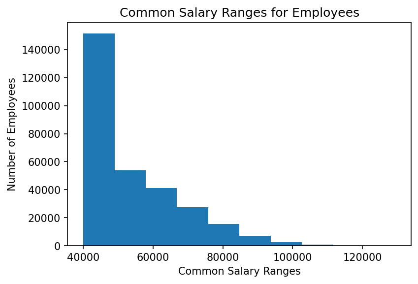
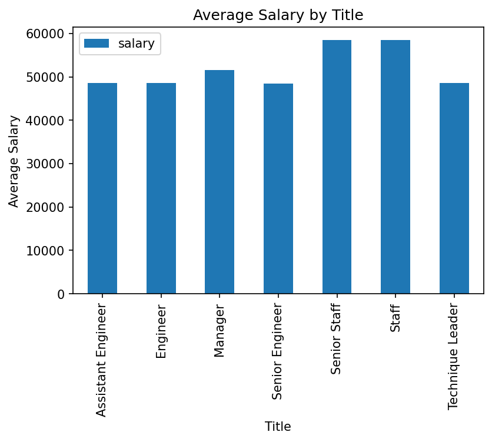

# SQL-challenge - Employee Database:
## A Mystery in Two Parts
------------------------------------------------

## Background

#### It is a beautiful spring day, and it is two weeks since I've been hired as a new data engineer at Pewlett Hackard. My first major task is a research project on employees of the corporation from the 1980s and 1990s. All that remain of the database of employees from that period are six CSV files.

In this assignment, I designed the tables to hold data in the CSVs, import the CSVs into a SQL database, and answer questions about the data. In other words, I performed:

1. Data Engineering
   * Create a Table Schema for each CSV file
   * Import each CSV file into the corresponding SQL table.
   * [table schema](https://github.com/Kpearson72/sql-challenge/blob/main/EmployeeSQL/SQL_files/table_schemata.sql)

2. Data Analysis
   * [query](https://github.com/Kpearson72/sql-challenge/blob/main/EmployeeSQL/SQL_files/queries.sql)

## Bonus

### As I examined the data, I was overcome with a creeping suspicion that the dataset is fake. I surmised that my boss handed me spurious data in order to test the data engineering skills of a new employee. To confirm my hunch, I decided to take the following steps to generate a visualization of the data, with which I will confront my boss:

1. Import the SQL database into Pandas. 
   
2. Create a histogram to visualize the most common salary ranges for employees.
   
   

3. Create a bar chart of average salary by title.
   
   

## Epilogue

### Evidence in hand, I marched into my boss's office and present the visualization. With a sly grin, my boss thanks me for my work. On my way out of the office, you hear the words, "Search your ID number." You look down at your badge to see that your employee ID number is 499942.

